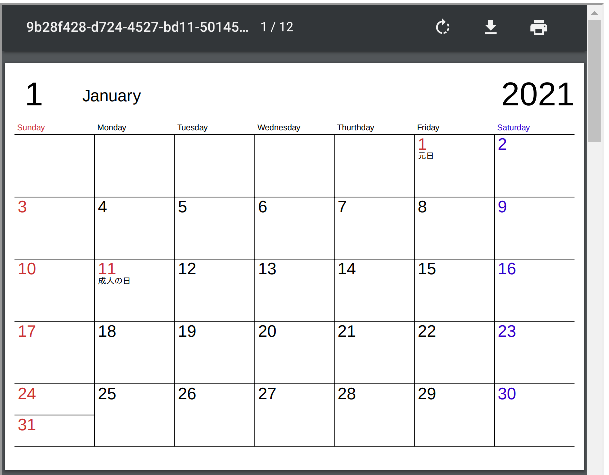

WIP

simple-calendar.js
==================

Create a simple calendar PDF file for printing.


sample:

```
<script src="japanese-holidays.min.js"></script>
<script src="pdfkit.standalone.js" charset="UTF-8"></script>
<script src="simple-calendar.js" charset="UTF-8"></script>
<script src="blob-stream.js"></script>
<script type="text/javascript" src="https://code.jquery.com/jquery-latest.js"></script>

<script type="text/javascript">
var jpn_holidays = function(sd) {
    var h = JapaneseHolidays.isHoliday(sd);
    if (h)
	return { holiday: true, text: h };
    return null;
}
var request = new XMLHttpRequest();
request.open('GET', 'ipaexg.ttf', true);	// IPAex Gothic for Japanese
request.responseType = "arraybuffer";

request.onreadystatechange = function() {
    if (request.readyState == 4 && request.status == 200) {
	var doc = new PDFDocument({autoFirstPage: false});
	doc.registerFont("Gothic", request.response);	// XXX "Gothic"? consider not Japanese
	for (var i = 1; i <= 12; i++)
	    addPage(doc, 2021, i, jpn_holidays, 0);
	var stream = doc.pipe(blobStream());
	var iframe = document.querySelector("iframe");
	doc.end();
	stream.on('finish', function() {
	    iframe.src = stream.toBlobURL('application/pdf');
	    var a = document.createElement("a");
	    document.body.appendChild(a);
	    a.style = "display: none";
	    a.href = stream.toBlobURL('application/pdf');
	    a.download = "calendar.pdf";
	});
    }
};
request.send();
</script>

```


